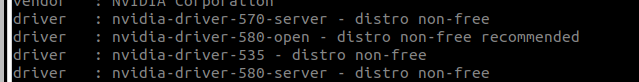

# ROS2 공부

## 1.우분투 설정 (22.04버전 기준)

### 초기 세팅
- 초기 업데이트
```
sudo apt update && sudo apt upgrade -y
sudo apt install -y wget curl gnupg
```
- 홈 화면 Ctrl+H로 필요 없는 것 안보이게 하기
```
cat > ~/.hidden << 'EOF'
Downloads
Pictures
Templates
Documents
Music
Public
Videos
snap
Desktop
EOF
```

- Github Desktop
```
sudo apt update && sudo apt install -y wget curl
wget -O /tmp/github-desktop.deb https://github.com/shiftkey/desktop/releases/download/release-3.4.9-linux1/GitHubDesktop-linux-amd64-3.4.9-linux1.deb
sudo apt install -y /tmp/github-desktop.deb
rm /tmp/github-desktop.deb
```
- vscode
```
sudo apt update
wget -O- https://packages.microsoft.com/keys/microsoft.asc | sudo gpg --dearmor | sudo tee /usr/share/keyrings/vscode.gpg
echo deb [arch=amd64 signed-by=/usr/share/keyrings/vscode.gpg] https://packages.microsoft.com/repos/vscode stable main | sudo tee /etc/apt/sources.list.d/vscode.list
sudo apt update
sudo apt install code
code 
```
- ros2 설치 (sh run.sh 작동 안되면 `source ~/.bashrc` 한 번 하고 다시 하기)
```
#shout out to 진선..
curl -L -O https://github.com/Jinsun-Lee/ros2_humble_install_sh/raw/main/run.sh
sh run.sh
```

- bashrc 설정
```
sudo gedit ~/.bashrc
```

```
alias bashrc='gedit ~/.bashrc'
alias ㅠㅁ녹ㅊ='gedit ~/.bashrc'

alias sb='source ~/.bashrc'
alias 뉴='source ~/.bashrc'

alias c='clear'
alias ㅊ='clear'


qqq() {    
    sudo pkill -9 -f "rqt|gazebo|rviz|ign"
    sudo pkill -9 -f "ros2|gz|gazebo|ign|rqt | python3"
    
    sudo pkill -9 -f "ros2" 2>/dev/null
    sudo pkill -9 -f "/opt/ros/humble" 2>/dev/null
    
    sudo pkill -9 gzserver 2>/dev/null
    sudo pkill -9 gzclient 2>/dev/null
    sudo pkill -9 ign      2>/dev/null
    sudo pkill -9 gazebo   2>/dev/null

    sudo pkill -9 rviz2 2>/dev/null
    sudo pkill -9 rqt   2>/dev/null

    sudo pkill -9 -x robot_state_publisher 2>/dev/null
    sudo pkill -9 -x static_transform_publisher 2>/dev/null
    sudo pkill -9 -x spawner 2>/dev/null
    sudo pkill -9 -f controller_manager 2>/dev/null
    
    # 중단한 프로세스도 종료해
    ps -u $USER -o pid,stat,cmd \
    | grep "/home/jinsun/jetank_ws/install" \
    | grep -v grep \
    | awk '{print $1}' \
    | xargs -r kill -9
    
    # 좀비/중단된 grep ERROR|FATAL 프로세스 정리
    ps -u "$USER" -o pid=,stat=,command= | \
    awk '$2 ~ /T/ && $3 ~ /^grep/ && $0 ~ /\(ERROR\|FATAL\)/ {print $1}' | \
    xargs -r kill -9
} 

alias ㅂㅂㅂ='qqq'

```

- Nvidia GPU 사용 시 (cuda설치)
    - 버전 확인
    ```
    ubuntu-drivers devices
    ```
    - 여기서 끝에 recommended라고 되어있는 것 
        
    
    
    - 이렇게 떴다면
    ```
    # sudo apt install nvidia-driver-(추천받은 버전)
    # ex)
    # sudo apt install nvidia-driver-580-open
    ```
    - reboot

- pytorch 설치
    - python 확인
    ```
    python3 --version
    pip3 --version
    ```
    - 둘 중 하나라도 없으면
    ```
    sudo apt install python3 python3-pip
    ```
    - pytorch 설치
    ```
    pip3 install torch torchvision torchaudio --index-url https://download.pytorch.org/whl/cu128
    ```

- rqt 플러그인 모두 설치
    ```
    sudo apt update
    source /opt/ros/humble/setup.bash
    sudo apt install ros-humble-rqt* -y
    rqt --force-discover
    ```
- ros gazebo(ver. ignition) 설치
    ```
    sudo apt update
    source /opt/ros/humble/setup.bash
    sudo apt install ros-humble-ros-gz -y
    sudo apt install ros-humble-gz-ros2-control ros-humble-gz-ros2-control-demos -y
    sudo apt install ros-humble-ign-ros2-control ros-humble-ign-ros2-control-demos -y
    ```


### 한국어 설정
- [참조 주소](https://gosury32.tistory.com/24)
1. settings -> Region&Language -> Manage Installed Languages 눌러 언어 설치
2. 설치 후 reboot
3. settings -> keyboard -> Input Sources 에 [+] 클릭하여 Korean 선택하면 `Korean(Hangul)` 클릭
4. Input Sources에 English 오른쪽 점 세게 눌러 remove
5. 터미널에서 `sudo gedit /usr/share/X11/xkb/keycodes/evdev` 들어가기
6. `<RALT> = 108;` 이 걸 찾아서 주석처리(//로 주석)
7. Ctrl+F로 `130` 을 검색
8. `<HNGL> = 130;` 으로 되어있는 것을 `<HNGL>=108;` 로 변경
9. 저장 후 컴퓨터 재시작


### Terminator에서 BroadCast-All 사용시 글씨 두번씩 눌리는 오류
1. 터미널에서 `sudo gedit /usr/bin/terminator` 들어가기
2. gedit에서 Ctrl+F 로 `os.environ['IBUS_DISABLE_SNOOPER']=` 검색
3. 뒤에 1로 되어있는 것 0으로 바꾸기
4. 재시작

### Ubuntu / ROS 기본 사용법

- 터미널 명령어
    - 터미널에서 tab 버튼은 생활화 하자(매우 긴 파일 입력 귀찮음) tab으로 자동완성 할 수 있다.
    - tab을 두번 누르면 현재까지 적은 글씨에 해당하는 파일 list를 볼 수 있다.

```
#홈으로 가고 싶다 (home의 단축어 : ~)
cd
#또는
cd ~

# 현재 위치의 목록을 보고 싶다
ls
# 모든 정보(권한 같은 것도 보고 싶다)
ls -al

# 현재 폴더의 특정 파일을 지우고 싶다
rm -f 특정파일

# 현재 폴더 내에 있는 폴더를 전부 지우고 싶다 (안에 내용도 다 지우기)
rm -rf 폴더 

# 현재 폴더 내에 폴더를 만들고 싶다
mkdir (만들고 싶은 폴더이름)

# 폴더 복사하고 싶다 (이거는 불확실)
cp (복사할 파일) (이동 위치)

# 현재 터미널 내용 다 없애버리고 싶다
clear

# 현재 폴더 위치(주소)
pwd
```

- ros2 설명

- 기본적으로 특정 워크스페이스 안에 SRC 폴더 안에 패키지명(폴더) 안에 launch폴더 안에 launch파일이 있다.
- 패키지는 이미 있는 것을 쓴다는 가정 (패키지를 만들 정도면 이걸 안 볼 듯)


- 빌드하기
    - 기본적으로
    `colcon build`
    - 이건 꼭 내가 빌드하고 싶은 패키지의 워크스페이스에서 진행해야한다.
    - 예를 들어 turtlebot_ws 안에 turtlebot_cartographer 패키지를 쓰기 위해 src안에 turtlebot_cartographer라는 패키지 폴더를 넣고(그러면 아마 현재 위치가 ~/turtlebot_ws/src/)
    - 현재 위치(~/turtlebot_ws/src/) 여기서 하면 빌드가 안됨
    ```
    cd ~/turtlebot_ws
    colcon build
    ```
    - 이렇게 해야 빌드가 됩니다.
    - 빌드가 되면 워크스페이스에 build/ install/ log/ 이 3개의 폴더가 나온다.


- 빌드 이후 패키지 사용한다는 명시 해주기
    - 만약에 turtlebot_ws에서 colcon build를 한 후에 이 cartographer라는 패키지를 사용하기 위해서는
    - setup.bash를 한번 실행 해줘야한다.
    ```
    source ~/turtlebot_ws/install/setup.bash
    ```
    - 이것을 내가 패키지를 실행하고 싶은 터미널에 적으면 된다.
    - 만약 새 터미널을 열고 패키지를 쓰고 싶으면 그 터미널에도 명령어를 입력해야한다.(새 터미널에 적용 X)

- source ~/.bashrc
    - 현재 내 .bashrc 파일 안에 sb로 단축어로 적어놨음
    - 이것을 하면 .bashrc 안에 내용이 한 번 적용이 된다고 보면 됨(각 터미널 마다)
    - 기본적으로 새 터미널을 켜면 sb를 한 번 한 것이라고 생각하면 됨
    - 새로 고침 느낌이라고 생각하면 됨

- launch 파일 실행 방법
    - 기본 적으로 위의 내용을 다 이해하고 했다는 가정하에
    ```
    ros2 launch (패키지 명) (런치파일 이름)
    ```


